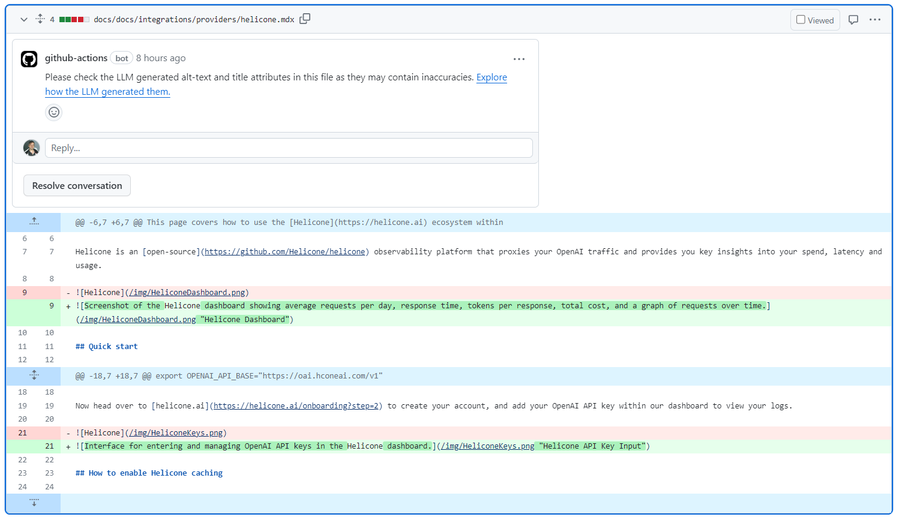
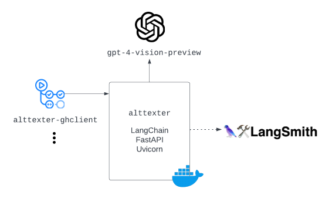

# alttexter-ghclient

[](https://github.com/jonathanalgar/langchain/pull/3/files#diff-13f93b90ba1f5e943cfbd17a52a1ab71a43c3dd7797e96f959cc17dccaaac198)

> :bulb: *Full demo:* https://github.com/jonathanalgar/docs-demo/pull/1

 [](https://sonarcloud.io/summary/new_code?id=jonathanalgar_alttexter-ghclient) [](https://sonarcloud.io/summary/new_code?id=jonathanalgar_alttexter-ghclient) [](https://makeapullrequest.com) 

## Overview

[](https://jonathanalgar.github.io/slides/Using%20AI%20and%20LLMs%20in%20docs-as-code%20pipelines.pdf)

Containerized GitHub action for interacting with the [alttexter](https://github.com/jonathanalgar/alttexter) service.

The action searches for missing alt text and title attributes in markdown-formatted files on commit to a pull request. On match, it bundles the text and images off in a request to the [alttexter](https://github.com/jonathanalgar/alttexter) service for generation. Responses from the service are committed and a comment on the file posted.

### In the wild

* https://github.com/OutSystems/docs-odc/commit/acf34564cd19130b6b0b7979af70b07275e4c797
* https://github.com/langchain-ai/langchain/pull/15357

## Usage

First, create a new GitHub action workflow in your repo (eg. `.github/workflows/alttexter.yml`):

```yaml
name: alttexter

on:
  pull_request:
    types: [opened, synchronize]
    paths:
      - '**.md'
      - '**.mdx'
      - '**.ipynb'
      
permissions:
  contents: write
  pull-requests: write
  issues: write

jobs:
  alttexter-ghclient:
    runs-on: ubuntu-latest
    container: 
      image: ghcr.io/jonathanalgar/alttexter-ghclient:latest
      credentials:
        username: ${{ github.actor }}
        password: ${{ secrets.GITHUB_TOKEN }}

    steps:
      - name: Set ref for checkout
        id: set_ref
        run: |
          echo "REF=${{ github.event.pull_request.head.ref }}" >> $GITHUB_ENV

      - name: Checkout
        uses: actions/checkout@v4.1.1
        with:
          fetch-depth: 1
          ref: ${{ env.REF }}

      - name: Run script
        env:
          GITHUB_REPOSITORY: ${{ github.repository }}
          PR_NUMBER: ${{ github.event.pull_request.number }}
          ALTTEXTER_ENDPOINT: ${{ secrets.ALTTEXTER_ENDPOINT }}
          ALTTEXTER_TOKEN: ${{ secrets.ALTTEXTER_TOKEN }}
          ALTTEXTER_RATEMINUTE: ${{ secrets.ALTTEXTER_RATEMINUTE }}
          GITHUB_TOKEN: ${{ secrets.GITHUB_TOKEN }}
        run: python /app/alttexter-ghclient.py
```

You'll need to [add the following repo secrets](https://docs.github.com/en/codespaces/managing-codespaces-for-your-organization/managing-development-environment-secrets-for-your-repository-or-organization#adding-secrets-for-a-repository):

* `ALTTEXTER_ENDPOINT`: Endpoint URL of the running `alttexter` (eg. `https://alttexter-prod.westeurope.cloudapp.azure.com:9100/alttexter`)
* `ALTTEXTER_TOKEN`: Single token for service.
* `ALTTEXTER_RATEMINUTE`: Maximum number of calls to `alttexter` service per minute. Consider [OpenAI rate limits](https://platform.openai.com/docs/guides/rate-limits) for your tier. I'd reccomend no more than 3.

Optionally you can [add repo environment variables](https://docs.github.com/en/actions/learn-github-actions/variables#creating-configuration-variables-for-a-repository) `ALTTEXTER_GITHUB_TOKEN_OVERRIDE` (text of a repo secret name, for example `CR_TOKEN`—if using pass the secret in `alttexter.yml`), `ALTTEXTER_GITHUB_USERNAME` & `ALTTEXTER_GITHUB_EMAIL` to override the default GitHub token, username and email used for commits.

Once that's done you can open a PR with files that need alt text and/or title attributes.

## Features

* Helpful in running in docs repos on an ongoing basis or for one-off batch updates (fully async handy for this).
* Friendly UX that posts a review request to the PR after each commit.
* Handles both local image files and those defined as URL.
* Handles `md*` and `ipynb` files according to their respective formatting requirements.

## TODO

- [ ] Better error handling
- [ ] Unit tests
- [ ] Extend this TODO list
